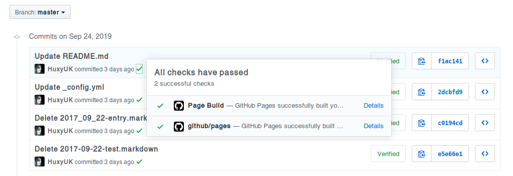

# Julia

A minimalistic jekyll theme

---------------------------
Home page


---------------------------

Posts will be listed by category in the `Archive` page alongside with their tags


---------------------------

How to use it
=========


### Configurations
Edit the `_config.yml` file and make the theme yours
 * Change the **username** to your own. You need to ensure the ```baseurl``` and ```url``` settings match the website URL. You can find this in the settings page.
 * You can change the base color in */css/main.sccs*  ```$brand-color:      new-color;```
 * To enable comments modify the ```disqus_shortname```
 * To enable google-analytics set ```google-analytics``` to true and paste your tracking code in ```/_inludes/google_analytics.html```
 * To add links to the navbar edit the ```links``` section

---------------------------

### Enabling the site
To enable to the web site:
 * Access the settings tab. 
 * Scroll down to the GitHub Pages section and select the master branch as your source
 * A URL will be generated which is where the site will be accessible


---------------------------

### New Posts
All new posts need to be stored in the _posts folder and must follow the syntax used in the existing entries:
 * Name the file %YYYY%-%MM%-%DD%-%title%.markdown i.e.  ```2017-07-01-dynamic-memory.markdown```
 * Adapt the following header in each post:
    ```
    ---
    layout: post
    title: Dynamic Memory 101
    date: 2017-07-01T15:09:00.000Z
    description: what is dynamic memory?
    published: true
    category: development
    tags:
    - c++
    - low level programming
    ---
    ```
 * After committing the post you can view the build status directly on the commit page:
    
 
---------------------------


### Local development

- Clone the repository to your computer and run it

    ``` sh
    $ git clone https://github.com/kuoa/julia.git
    $ bundler install
    $ jekyll serve
    ```

---------------------------

### Links 
### [GitHub Markdown Cheatsheet](https://guides.github.com/pdfs/markdown-cheatsheet-online.pdf) and  [GitHub Markdown Examples](https://github.com/adam-p/markdown-here/wiki/Markdown-Cheatsheet)


---------------------------
### Author  [](https://github.com/kuoa)
---------------------------
### License  [](https://github.com/kuoa/julia/blob/master/LICENSE)
